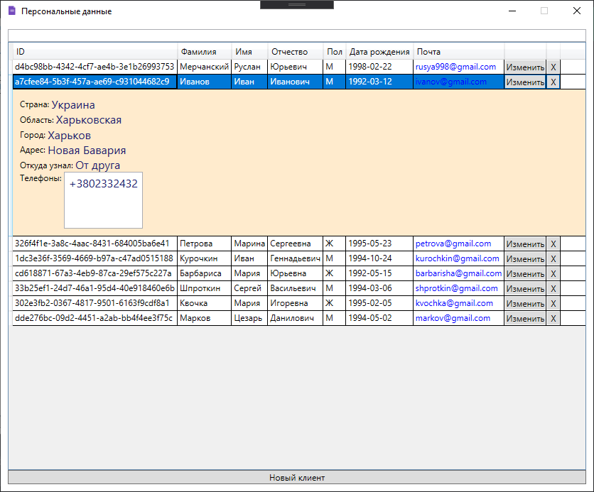
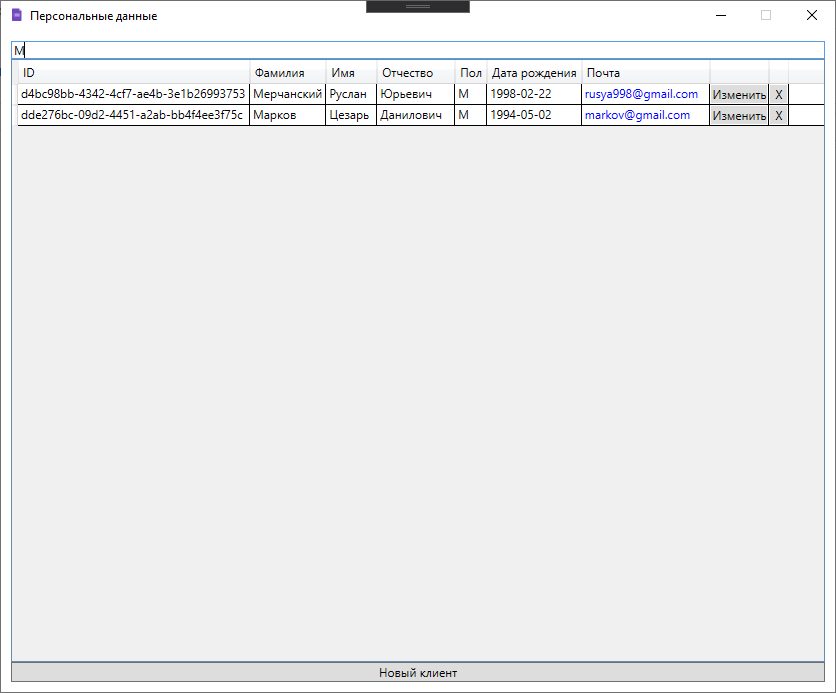

# PersonalData

Filter works by 'Surname' field

Database SqLite Connection:

Recommended for Debug
1) App.config -> <add name="DefaultConnection" connectionString="Data Source=D:\GitProjects\ForStudy\PersonalData\db.sqlite" />
It's full path for Database file 'db.sqlite'

Recommended for Release
2) App.config -> <add name="DefaultConnection" connectionString="Data Source=.\db.sqlite" />
It's the path next to the .exe file 'db.sqlite'
